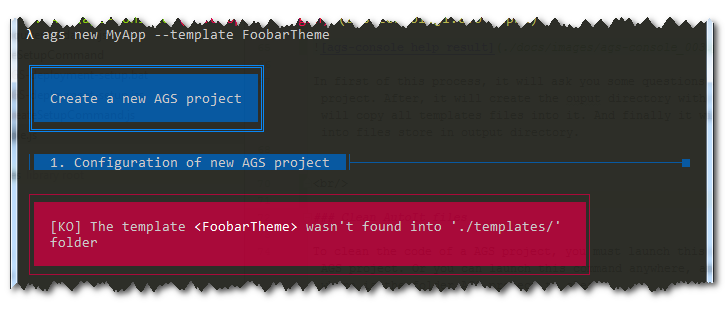

AGS-console
===========


> AGS-console provides commands created in the Node.js ecosystem in order to help developpers who built an AutoIt project with AGS. AGS-console is a subproject of AutoIt Gui Skeleton [AGS](https://v20100v.github.io/autoit-gui-skeleton/). You can also customize and create your own commands to help your production.


<br/>

- [AGS-console](#ags-console)
  * [What is AGS-console ?](#what-is-ags-console--)
  * [Features](#features)
    + [Centralized all commands of AGS into an application console](#centralized-all-commands-of-ags-into-an-application-console)
    + [Create a new AGS project](#create-a-new-ags-project)
    + [Clean AutoIt files](#clean-autoit-files)
  * [Develop and extends AGS console](#develop-and-extends-ags-console)
    + [Requirements for AGS console commands](#requirements-for-ags-console-commands)
      - [Install `Node.js`](#install--nodejs-)
      - [Install `yarn`](#install--yarn-)
      - [Install all Node.js dependencies.](#install-all-nodejs-dependencies)
    + [Running the application locally with index.js](#running-the-application-locally-with-indexjs)
    + [Running the application locally as a global npm module](#running-the-application-locally-as-a-global-npm-module)
    + [How to package AGS console into an independant executable ?](#how-to-package-ags-console-into-an-independant-executable--)
    + [How to create a new command for AGS console ?](#how-to-create-a-new-command-for-ags-console--)
  * [About](#about)
    + [Release history](#release-history)
    + [Contributing](#contributing)
    + [License](#license)

<br/>


## What is AGS-console ?

AGS-console is a subproject of AutoIt Gui Skeleton [AGS](https://v20100v.github.io/autoit-gui-skeleton/). AGS-console is a command line application (CLI) build in the Node.js ecosystem with the library [Caporal.js](https://github.com/mattallty/Caporal.js). It provides commands to help developpers who built an AutoIt project with AGS. The goal of AGS is to give an environment and tools for developers, that makes it easy to build AutoIt applications. AGS propose to use conventions and a model to organize the code of an AutoIt Application with an graphic user interface (GUI).

More information about [AGS](https://v20100v.github.io/autoit-gui-skeleton/).


<br/>

## Features

### Centralized all commands of AGS into an application console


<br/>

### Create a new AGS project

When you start a new project, it can often ve a repetitive and boring process. For each new project, it more confortable to have an automate to do this. This command will allow you to quickly scaffold out a new project using a given template. It will be completely extensible so that you can easily create a new template and adapt it to your own needs.

To create a new AGS project call *MyApp*, just type:

```
λ ags new MyApp
```


You can add a verbose mode with `--verbose` option for output debug messages.


In first of this process, it will ask you some questions in order to configure your new AGS project. After, it will create the ouput directory with the name of your new AGS project. It will copy all templates files into it. And finally it will replace all template variables into files store in output directory.

When you create a new project, it use the default template, store in `./templates/default/ directory`. Moreover you can also customize an create your own template, in order to be more adaptable to your needs. If you want develop and extend ags-console, all templates must store into a folder in the root directory `./templates/`. For example create the folder `./templates/FoobarTheme/` and just create a README file it. To use another template just use the `--template` option

```
λ ags new MyApp --template FoobarTheme
```

If the template doesn't found, it will return an error like this:




<br/>

### Clean AutoIt files 

To clean the code of a AGS project, you must launch this command into the root folder of the AGS project. Or you can launch this command anywhere, and specify with the `directory` option where is the folder AGS project to clean.

To clean the current working directory (./), type:

```
λ ags clean
```

To clean a specific directory type this instruction. You can use a relative or absolute path, as you prefered.

```
λ ags clean --directory .\MyApp\
λ ags clean --directory D:\AGS\MyApp\
```


You can add a verbose mode with `--verbose` option for output debug messages.


<br/>

## Develop and extends AGS console

### Requirements for AGS console commands

#### Install `Node.js`

We will use [Node.js](https://nodejs.org/) as an environment for developers, and we take benefits of its tools.

First we assume that you have installed [Node.js](https://nodejs.org/). If it's not case, we can go to the website [Node.js](https://nodejs.org/), donwload and execute the setup... or you can take a [chocolatey](https://chocolatey.org/) !!! As THE package manager for Windows, Chocolatey easily manage all aspects of Windows software (installation, configuration, upgrade, and uninstallation). If we don't know it, you can find here the documentation to install it : [https://chocolatey.org/install](https://chocolatey.org/install)

Run your prefered windows command ; cmd, cmder or powershell ; as an administrator and type:

```bash
λ choco install nodejs
```

<br/>

#### Install `yarn`

We use [Yarn](https://yarnpkg.com/en/docs/install#windows-stable) as a package manager for code, instead of npm. Once you have Chocolatey installed, you may install yarn by running the following code in your console. This will also ensure that you have Node.js installed.

```bash
λ choco install yarn
```

<br/>

#### Install all Node.js dependencies.

To install all dependencies, we use [Yarn](https://yarnpkg.com/en/docs/install#windows-stable) as a package manager for code, instead of npm. Just type as the root folder of folder. All dependencies are always described in `package.json` file.

```bash
λ yarn install
```

<br/>

### Running the application locally with index.js

To run this application locally, just execute the main entry program index.js on root folder. But with this approach, you only can execute this program on root folder. To do this, type:

```bash
λ node index.js
```

<br/>

### Running the application locally as a global npm module

Since you’re developing the generator locally, it’s not yet available as a global npm module. From the root of your generator project (in the generator-name/ folder), type:

```bash
λ yarn link
```

That will install your project dependencies and symlink a global module to your local file. After npm is done, you’ll be able to call this console application with its name `λ ags` define in bin property of `package.json` file.


<br/>

### How to package AGS console into an independant executable ?

In order to package this application, we use [pkg.js](https://github.com/zeit/pkg). It give us a CLI tool which is able to package a Node.js project into an executable that can be run even on devices without Node.js installed.

As you can see on its description, pkg.js can:

 - Instantly make executables for other platforms (cross-compilation)
 - Make some kind of self-extracting archive or installer
 - No need to install Node.js and npm to run the packaged application
 - No need to download hundreds of files via npm install to deploy your application. Deploy it as a single file
 - Put your assets inside the executable to make it even more portable

To make this executable, you must install node dependencies developpement defines in package.json, or install manually pkg as a global node module with :

```bash
λ yarn global add pkg
```

To launch the build, you can use alias define in package.json:

```bash
λ npm run pkg
λ npm run package-x86
λ npm run package-x64
```

This command will create the binary `Ags.exe` into `./build` directory.


<br/>

### How to create a new command for AGS console ?

1 - Create a new folder into ./lib/commands/ with a name which must respect this convention `xxxCommand`, and after create into this folder a file with the same name `xxxCommand.js`. For example create this `./lib/commands/MyAmazingCommand/MyAmazingCommand.js`.

2 - AGS console use [Caporal.js](https://github.com/mattallty/Caporal.js?), and an AGS command is only the callback action attache to a command caporal. So the file `MyAmazingCommand.js` as a module Node.js must look like that:

```js
// ./lib/commands/MyAmazingCommand/MyAmazingCommand.js

/**
 * Set action for MyAmazingCommand
 *
 * @public
 * @param arguments, all caporal's command arguments
 * @param options, all caporal's command options
 * @param logger, winston logger configure into caporal. It is an extended version defined in AGS.
 */
module.exports = (arguments, options, logger) => {

    logger.title('My amazing command');
    
    // Only visible in output console if we pass verbose option (-v)
    logger.debug('[INFO] arguments given', arguments);
    logger.debug('[INFO] options given', options);
    
    console.log('\n--- end ---\n');
}
```

3 - Register this command with the method `configureCaporal()` into the file `AgsConsole.js`.

```js
// ./lib/AgsConsole.js

// (...)

AgsConsole.prototype.configureCaporal = function () {
    this.caporal
        
        // (...)
  
        .command('amazing', 'An amazing command to touch the sky !!!')
        .argument('<sky>', 'Argument to use with this command.')
        .option('-i, --incredible <heros>', 'Option to use with this command.')
        .action(require('./commands/MyAmazingCommand/MyAmazingCommand'))
};
```

For more information of how to configure a command, go to [Caporal.js](https://github.com/mattallty/Caporal.js?) read the documentation.
  

<br/>

## About

### Release history

 - AGS-console v1.0.0-alpha - *2018.07.03*


<br/>

### Contributing

Comments, pull-request & stars are always welcome !


<br/>

### License

Copyright (c) 2018 by [v20100v](https://github.com/v20100v). Released under the [MIT license](https://github.com/v20100v/ags-console/blob/develop/LICENSE.md).
